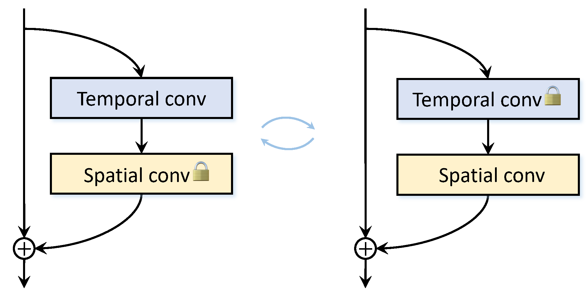

# AltFreezing for More General Video Face Forgery Detection [CVPR 2023 Highlight :tada:]
<b><a href="https://zhendongwang6.github.io/">Zhendong Wang<a>, <a href='https://jianminbao.github.io/'>Jianmin Bao</a>, <a href='http://staff.ustc.edu.cn/~zhwg/'>Wengang Zhou</a>, Weilun Wang, <a href='http://staff.ustc.edu.cn/~lihq/en/'>Houqiang Li </a> </b>

[Paper](https://openaccess.thecvf.com/content/CVPR2023/papers/Wang_AltFreezing_for_More_General_Video_Face_Forgery_Detection_CVPR_2023_paper.pdf)

## Abstract
> Existing face forgery detection models try to discriminate fake images by detecting only spatial artifacts (e.g., generative artifacts, blending) or mainly temporal artifacts (e.g., flickering, discontinuity). They may experience significant performance degradation when facing out-domain artifacts. In this paper, we propose to capture both spatial and temporal artifacts in one model for face forgery detection. A simple idea is to leverage a spatiotemporal model (3D ConvNet). However, we find that it may easily rely on one type of artifact and ignore the other. To address this issue, we present a novel training strategy called AltFreezing for more general face forgery detection. The AltFreezing aims to encourage the model to detect both spatial and temporal artifacts. It divides the weights of a spatiotemporal network into two groups: spatial-related and temporal-related. Then the two groups of weights are alternately frozen during the training process so that the model can learn spatial and temporal features to distinguish real or fake videos. Furthermore, we introduce various video-level data augmentation methods to improve the generalization capability of the forgery detection model. Extensive experiments show that our framework outperforms existing methods in terms of generalization to unseen manipulations and datasets.

<p align="center">

</p>

## Dependencies
```shell
conda create -n altfreezing python=3.9
conda activate altfreezing
pip install torch==1.8.0+cu111 torchvision==0.9.0+cu111 -f https://download.pytorch.org/whl/torch_stable.html
pip install -r requirements.txt
```
## Inference
You can download weights from [RecDrive](https://rec.ustc.edu.cn/share/e87360b0-7b2e-11ef-aeef-a9fd0832d537)[password：altf] or [BaiduDrive](https://pan.baidu.com/s/1lH4R1NlHoW_16Xv_ArQhvw)[password：altf], and put it into `checkpoints`. Then run:
```python
python demo.py
```


## Contact
If you have any question, please contact ZhendongWang6@outlook.com or Jianmin.Bao@microsoft.com.

## Acknowledgments
Our code is borrowed from [FTCN](https://github.com/yinglinzheng/FTCN). Thanks for their sharing codes and models.

## Citation
```
@InProceedings{Wang_2023_CVPR,
    author    = {Wang, Zhendong and Bao, Jianmin and Zhou, Wengang and Wang, Weilun and Li, Houqiang},
    title     = {AltFreezing for More General Video Face Forgery Detection},
    booktitle = {Proceedings of the IEEE/CVF Conference on Computer Vision and Pattern Recognition (CVPR)},
    month     = {June},
    year      = {2023},
    pages     = {4129-4138}
}
```
